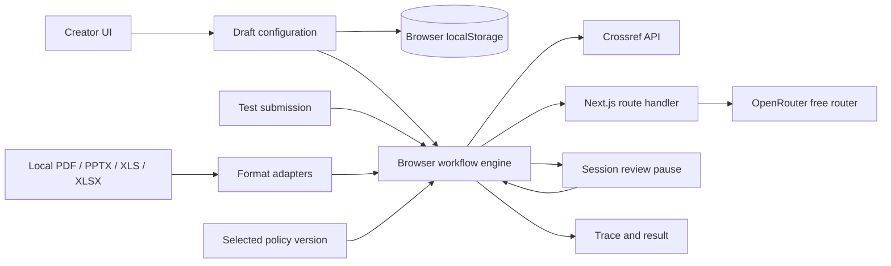

# Architecture

## Runtime boundaries

Next.js App Router serves the application. `app/studio-client.jsx` loads the existing studio as a client-only boundary because workflow state, localStorage, file inputs and PDF.js are browser-owned. The workflow engine still runs in the browser. Node route handlers expose only the AI status and assistance endpoints; Crossref is called directly from the browser.

## Source map

| Area | Files | Responsibility |
|---|---|---|
| App entry | `app/layout.jsx`, `app/page.jsx`, `app/studio-client.jsx`, `app/globals.css` | App Router shell, metadata, client boundary, global styles |
| Shell and forms | `src/main.jsx`, `src/style.css` | Navigation, inputs, preview, sidebar |
| Draft lifecycle | `src/useDraft.js`, `src/draftStorage.js` | Autosave, recovery, reset |
| Workflow UI | `src/WorkflowStudio.jsx`, `src/TreeBuilder.jsx`, `src/treeModel.js` | Canvas, edits, test orchestration |
| Settings | `src/BlockSettings.jsx`, `src/NodeSettings.jsx` | Generic blocks and tool configuration |
| Definitions | `src/workflowModel.js` | Ports, defaults, mappings, publication example |
| Execution | `src/workflowEngine.js` | Validation, handlers, traversal, reviews |
| Evidence adapters | `src/documentReader.js`, `src/pdfReader.js` | Local PDF, presentation and spreadsheet extraction |
| Results | `src/WorkflowTest.jsx`, `src/ResultSummary.jsx` | Submission form, trace, decision forms |
| Scoring | `src/ScoringStudio.jsx`, `src/scoringPolicy.js` | Standalone rules and saved versions |
| Documents | `src/pdfReader.js`, `src/paperFindings.js`, `scripts/copy-pdf-worker.mjs` | PDF text, candidates, browser-worker preparation |
| AI | `src/aiContext.js`, `server/ai.js`, `server/nextAiRoute.js`, `app/api/ai-*` | Bounds, provider calls, Next.js endpoints |

`src/WorkflowView.jsx` and `src/ExtractionPanel.jsx` are older retained implementations. The active main app imports `WorkflowStudio.jsx` under the local name `WorkflowView`; the similarly named old file is not the active entry point.

## State ownership

`useDraft` owns persisted name, fields, nodes, and standalone policy. App state separately owns submission values. `WorkflowStudio` owns runs, review history, and approved duplicate records. Refs prevent overlapping local actions and detect stale reviews after configuration/submission changes.

Canvas selection, zoom, library visibility, and undo are transient. Sidebar collapse has a separate preference key. Clear saved draft removes KPI storage and reloads, resetting session state while retaining sidebar preference.

## Graph and scoring design

Nodes and route IDs form a directed acyclic graph. The visual hierarchy can share a later node across paths. Layout derives from connections; execution follows one selected route at a time, not every visible branch.

The original publication template keeps its specialized decision/scoring/review handlers. Generic Actions reuse tool handlers without forcing every KPI to use twelve steps. New workflows use typed form mapping, common evidence extraction, multi-pair comparison, structured AI evaluation, human review, and versioned scoring. Legacy Read/External lookup/PDF-only steps remain loadable for saved-draft compatibility but are hidden from the new catalogue.

## Reusable tool layer

`reusableTools.js` defines generic tool ports, defaults, validation and execution. `ReusableSettings.jsx` exposes creator configuration. `PluginPicker.jsx` presents the built-in Publication catalogue; plugin wrappers retain legacy operation IDs and route contracts. No third-party package execution or runtime plugin installation is introduced.

Evidence sections carry PDF page, PPTX slide, or spreadsheet sheet/range locations. AI combines a primary input, named mapped contexts, creator rubric and optional output schema before the shared input-bound checks; provider calls are blocked when those checks indicate truncation. Parsed schema fields are validated before Conditions can consume them. Generic review assembles the complete executed evidence package and preserves it with the session decision.
