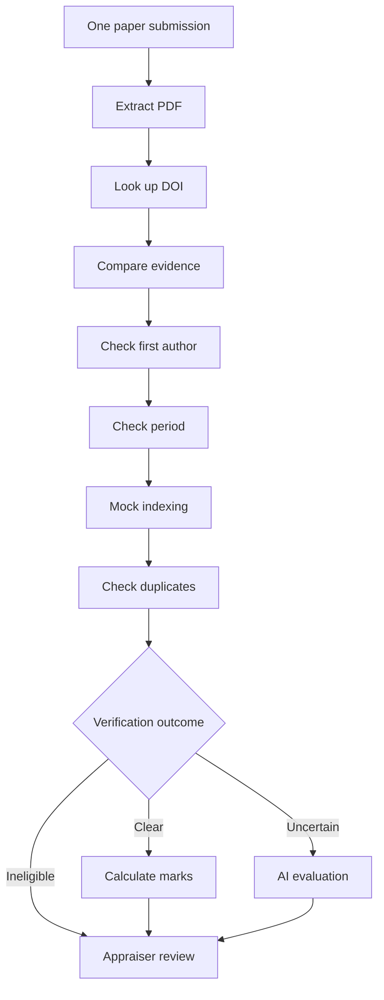

# Publication KPI walkthrough

## Policy scope

KPI: **Scopus / Web of Science / SAE Paper Publication**. The current automatic scoring example supports only the first-listed/primary author.

The project discussion identified a workbook conflict: a KPI row describes 50% for co-authors, while detailed guidelines distinguish second and third authors. SAE treatment and corresponding-author precedence were also unclear. Those unresolved rules are not silently implemented. The workbook itself was not re-audited for these docs.

| Supported example finding | Result |
|---|---|
| Primary author, both Scopus and WOS | 24 points |
| Primary author, either Scopus or WOS | 12 points |
| Confirmed outside period | 0 points |
| Other author position, conflict, missing evidence, SAE-only | Pending review |

Index status comes from a labelled mock registry. It is not a factual Scopus/WOS verification.

## 1. Inputs

Open Inputs. On an empty form, use **Or try publication example inputs**, or create:

| Field | Type | Required | Configuration |
|---|---|---|---|
| Research paper | File upload | Yes | `.pdf`, one file |
| DOI | Short text | No | DOI or DOI text |
| Publication URL | URL | No | URL containing the DOI |
| Faculty name | Short text | Yes | Full name for matching |

Set the KPI name. Existing agreed fields can be reused; do not replace them unnecessarily.

## 2. Load and inspect the example

Open Workflow → Build workflow. On an empty canvas, click **Explore the publication example**. This inserts the original twelve connected steps, not twelve paper submissions. One paper flows through them all as needed.

| Step | Required mapping/settings |
|---|---|
| Submit paper | Uses all form fields |
| Extract paper details | Research paper file |
| Look up publication | Extracted DOI; optional submitted DOI cross-check and URL |
| Compare evidence | Extracted paper + external publication record |
| Check first author | Faculty name + publication record |
| Check assessment dates | Publication record + configured dates/date rule |
| Check indexing | Publication record + mock registry |
| Check duplicates | Publication record + faculty name; optional seed records |
| Decide verification outcome | Comparison, author, dates, indexing, duplicate findings |
| AI evaluation | Decision output; instructions, mode, and optional schema |
| Calculate marks | Decision output; publication scoring rules |
| Appraiser review | Decision; optional score and AI details |

Use start `2021-01-01`, end `2021-12-31`, and Published date for the included sample. Keep the simulated registry entry for the first test. Use Simulated assistance for a deterministic offline AI rehearsal, or OpenRouter to generate actual advice.

The default routes are:

## 3. Scoring

Open Scoring policy → **Existing publication policies**, or select Calculate marks on the canvas. Review the 24/12 rules and multiplier 1.

Leave the standalone **Apply this policy to workflow Results** switch off for this original template. Its Calculate marks step already supplies a recommendation before terminal Appraiser review. Enabling the standalone policy against this legacy ending is rejected by preflight to avoid ambiguous scoring behavior.

## 4. Sample submission

Open Test & review, fix setup items, and click **Fill sample submission**.

| Value | Sample |
|---|---|
| Paper | Included PRISMA 2020 PDF |
| DOI | `10.1371/journal.pmed.1003583` |
| Faculty | `Matthew J. Page` |
| Published | 29 March 2021 |
| URL | `https://doi.org/10.1371/journal.pmed.1003583` |

The PDF is in `public/samples/prisma-2020-paper.pdf`; Download sample paper is also available in the test view. [Attribution](../public/samples/README.txt) is retained. A methodology guideline used as a fixture is not automatically eligible under a real institution's policy.

Run this submission. With consistent live Crossref metadata, the mock registry, and the configured period, the example recommends **24 points**. A network failure or mismatch can correctly produce pending review instead.

## 5. Review and edge cases

Enter an appraiser name, approve, and record the decision. The score and original recommendation remain visible. Overrides require a reason and non-negative points.

Without reloading, submit again: the same DOI/faculty pair should become a duplicate candidate. Change the period to 2022 to test ineligibility. Remove the mock record to test unknown indexing. A different first-author name should produce uncertainty. These cases are also covered by automated tests.

## Add a clear-path AI summary

Insert Action → AI evaluation on the Clear path. Name it Appraiser summary; map the verification decision object to its primary input. Suggested instructions:

> Summarize the verified findings for the appraiser in five bullets. Include authorship, assessment eligibility, indexing evidence, and limitations. Clearly label mock evidence. Do not invent missing facts.

Continue to Calculate marks or the next intended step. The existing Needs review AI can have different instructions. Inspect each executed AI response in the trace. A shared legacy review has one optional assistance mapping; it does not automatically merge responses from different branches.

## Publication plugin

To add these operations manually, click a workflow + → Plugin → Publication → the desired operation. The example loader wraps publication operations as plugin steps; older saved workflows still work. AI evaluation stays in general Actions. Publication decision preserves Clear / Needs review / Ineligible routes.
